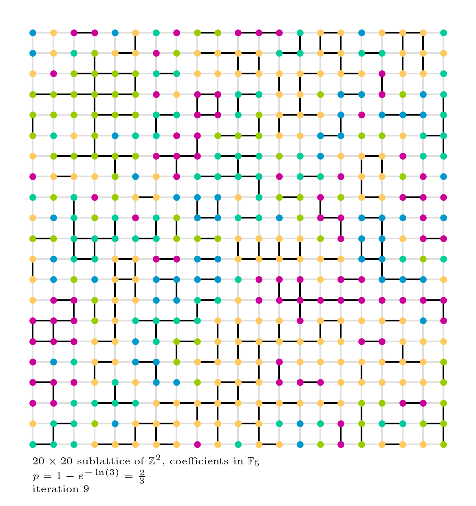

# `potts`
A high-performance(-ish) tool for running experiments on the Potts model.

## Installation
Clone this repository by `git clone https://github.com/apizzimenti/potts.git`
and run `sh setup.sh` in your favorite terminal. This installs the `potts` package
(and its dependencies) globally in development mode, so any changes you make to
the source are reflected system-wide.

## Usage
Use the `test/` directory for testing code to go into the package. Sample code
is below. If the `testing=True` flag is passed to the call to `SwendsonWang()`,
then output directories are created (though they should already exist) where the
`SwendsonWang` class expects them to exist.

```python
from potts import Lattice, SwendsonWang, Chain

# Create the Lattice, then instantiate the Swendson-Wang model.
L = Lattice([3, 3], field=3)
model = SwendsonWang()
initial = model.initial(L)

# Create the chain.
chain = Chain(L, model, initial, steps=10)

# Iterate over the chain.
for state in chain:
    <do whatever>
```

The `Lattice` class also provides features to generate and export images of two-
and three-dimensional integer lattices colored by inclusion; example code can
be found in `test/test-image-features.py`, which produces `.png` files like this one:

